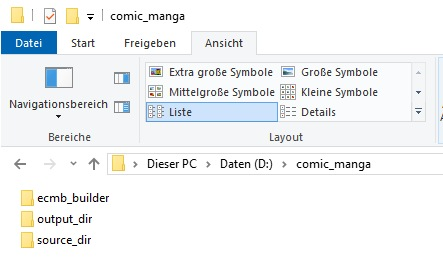
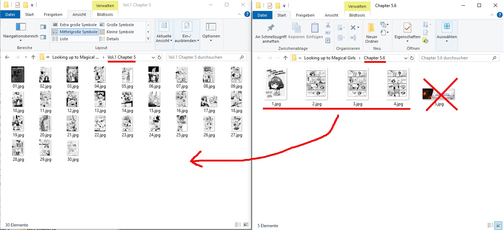
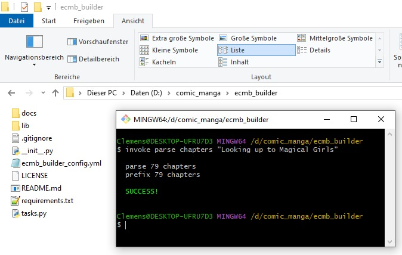
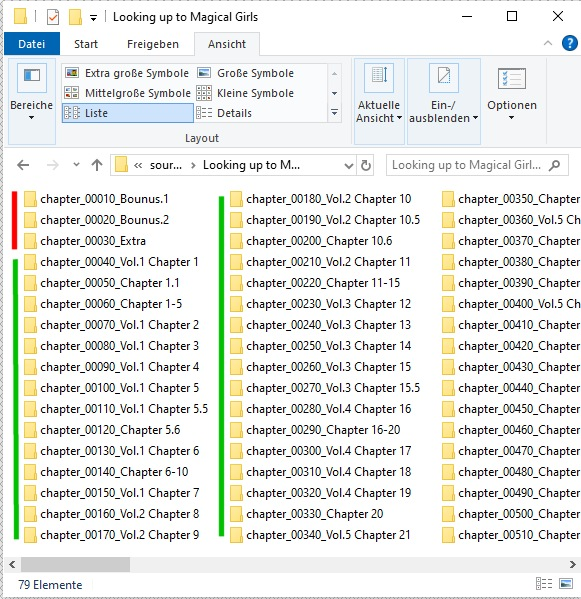
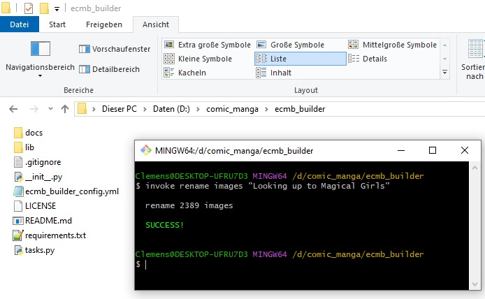
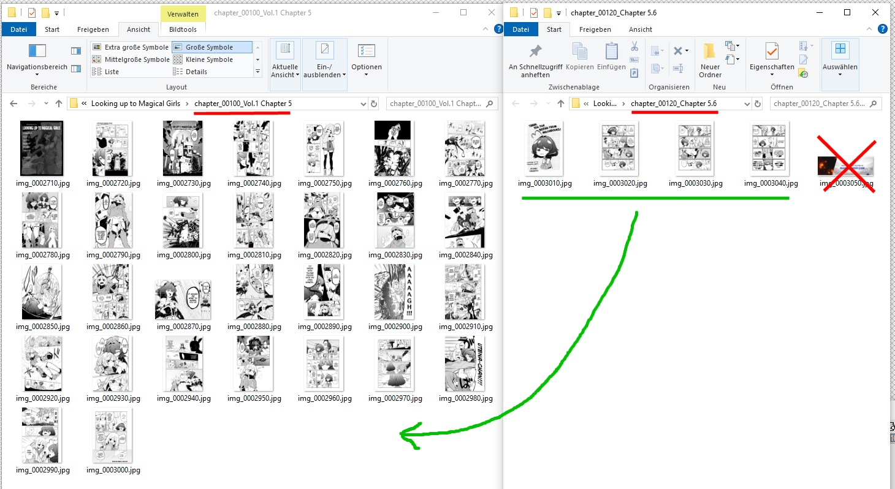
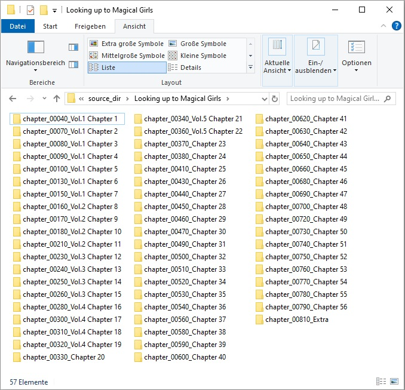
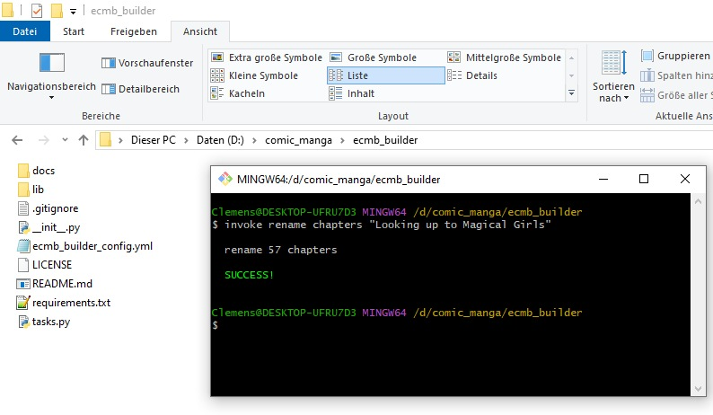
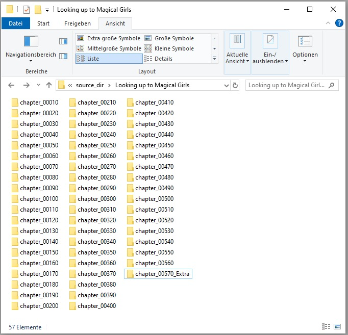
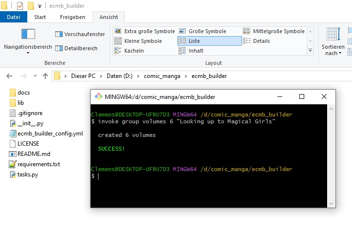

> [!WARNING]
> This project is still under developement, so please don't use it atm


### Homepage: [https://comic-manga-ebook.github.io](https://comic-manga-ebook.github.io)

### Table of contents:
- [About this repository](#about-this-repository)
- [Installation](#installation)
- [The source-files (in a perfect world)](#the-source-files-in-a-perfect-world)
- [The source-files (in real life)](#the-source-files-in-real-life)
- [Using the File-Cleaner](#using-the-file-cleaner)
  - [Available functions](#available-functions)
  - [Cleaning source-files example](#cleaning-source-files-example)
- [Using the Builder](#using-the-builder)
  - [Initialize](#initialize)
  - [Build](#build)


## About this repository:
This is a **simple-to-use Builder** to build *.ecmb-files from your source-images without knowing anything about programming. Its only capable of creating simple books with no sub-folders or advanced navigation.<br/>
In real life, when you have downloaded a comic or manga the files are really messy - the **File-Cleaner**  will make it easier for you cleaning the contents.

Published under [MIT License](https://choosealicense.com/licenses/mit/)

**Copyright:**

Copyright (c) 2023 Clemens K. (https://github.com/metacreature)

**If you like it I would be happy if you  [donate on checkya](https://checkya.com/1hhp2cpit9eha/payme)**<br /><br />


## Installation
- download and install Python3 (>=3.11) [https://www.python.org/downloads/](https://www.python.org/downloads/)<br/>
  Here is a little guide how to install python [https://www.digitalocean.com/community/tutorials/install-python-windows-10](https://www.digitalocean.com/community/tutorials/install-python-windows-10)
- download and install Git [https://git-scm.com/downloads](https://git-scm.com/downloads)<br/>
  Here is a little guide how to install and open git console: [https://www.youtube.com/watch?v=lKYtK-DS0MY](https://www.youtube.com/watch?v=lKYtK-DS0MY)
- create an empty folder on your harddisk (eg. "comic_manga") and open it
- download or clone the repository and save the contents to a subfolder "ecmb_builder"
- open the git-console with right-click (like you learned in the video) and then type or copy the commands to the console and press [enter] after each command:
    - `mkdir source_dir`
    - `mkdir output_dir`
    - `cd ecmb_builder`
    - `pip install -r requirements.txt`
- after that there are 3 subfolders in your "comic_manga"-folder: <br/> 
- open the folder "ecmb_builder" and open the config-file `ecmb_builder_config.yml` with any simple text-editor<br/>
  (I would recommend to use [https://notepad-plus-plus.org/downloads/](https://notepad-plus-plus.org/downloads/)) and do your settings there (or just leave it as it is).

<br />

## The source-files (in a perfect world)
Your source-files have to be located in "comic_manga/source_dir" (if you didn't specify a different one in the config-file)

File-Structure:
```
source_dir/
    ˪ My_Book_Folder
        ˪ chapter_0001
             ˪ img_0000010.jpg
             ˪ img_0000020.jpg
             ˪ img_0000030.jpg
             ˪ img_0000040.jpg
        ˪ chapter_0002
        ˪ chapter_0003
        ˪ chapter_0004
        ˪ cover_front.jpg
        ˪ cover_re.jpg
```
or 
```
source_dir/
    ˪ My_Manga_Name
        ˪ volume_001
            ˪ chapter_0001
               ˪ img_0000010.jpg
               ˪ img_0000020.jpg
               ˪ img_0000030.jpg
               ˪ img_0000040.jpg
            ˪ chapter_0002
            ˪ chapter_0003
            ˪ chapter_0004
            ˪ cover_front.jpg
            ˪ cover_rear.jpg
        ˪ volume_002
        ˪ volume_003
        ˪ volume_004
```
<br/>

- the file- and folder-names are sorted alphanumerc (like every file-system)
- files and folders starting with "__" (2 underscores) are ignored in general
- allowed image-extension: jpg, jpeg, png, webp
- if you have cover-images they have to have one of these names:

| Front-Cover:     | Rear-Cover:     |
| ---------------- | --------------- |
| cover_front.jpeg | cover_rear.jpeg |
| cover_front.jpg  | cover_rear.jpg  |
| cover_front.png  | cover_rear.png  |
| cover_front.webp | cover_rear.webp |
| front.jpeg       | rear.jpeg       |
| front.jpg        | rear.jpg        |
| front.png        | rear.png        |
| front.webp       | rear.webp       |
| f.jpeg           | r.jpeg          |
| f.jpg            | r.jpg           |
| f.png            | r.png           |
| f.webp           | r.webp          |
<br/>

**Note!** If you have many books in your source-folder you can organize them in subfolders<br /><br />

## The source-files (in real life)



<br />

## Using the File-Cleaner:
Of course you want to clean that mess and the File-Cleaner will make it easier for you.

### Available functions:
**Objects:**
- `volumes`
- `chapters`
- `images`
- `all`

**Functions:**

Functions will sort the names alphanumerical and will preserve their order.
- `zeropad`<br/>
  will prefix everything with 0000
- `prefix`<br/>
  will prefix everything with an incremental zero-filled number eg. 0010, 0020, 0030
- `reverse`<br/>
  will prefix everything with an incremental zero-filled number in reverse order
- `rename`<br/>
  will rename everything with an incremental zero-filled number. You will loose the original name

**Run it in git-console:**
- open the folder "ecmb_builder"
- open the git-console with right-click (like you have done before)
- type `invoke [FUNCTION] [OBJECT] "[YOUR_BOOK_FOLDER]"` eg. `invoke rename images "My_Book_Folder"` and press [enter]


**Special Functions**

Special functions will try to help you, but you have to check the results manually.
- `parse chapters`<br/>
  The renamer searches for a 'c' followed by one or two numbers and brings them to a new order with an incremental zerofilled prefix. It will shuffle up your chapter-folders, but you won't loose original name!
- `group volumes [NUMBER]`<br/>
  will group your chapter to [NUMBER] volumes, based on the average page-count

<br />

## Cleaning source-files example:

1) If we take the messy example from above i would suggest to `parse chapters` first:<br />
 <br /><br />
Now your folders will look like this. Of course you have to check it and solve issues manually:<br />
<br /><br />
2) After solving the issues you can run `rename images`:<br />
<br /><br />
Now your images have unique incremental names and you can merge chapters and clean images easily:<br />
<br /><br />
3) After you have merged the chapters manually your folder should look like this:<br />
<br /><br />
4) I guess you don't like the names and are too lazy to rename them manually. So run `rename chapters`<br />
<br /><br />
After that it should look like this, of course after you added "Extra" manually:<br />
<br /><br />
5) Finally, after you have deleted all advertisements and credits from your source-images yo can run `group volumes`:<br />
<br /><br />
Done! (of course you have to check the result)


<br />

# Using the Builder:

### 2) Initialize the book
- open the folder "ecmb_builder"
- open the git-console with right-click (like you have done before)
- type `invoke init "My_Manga_Name"`

**Note!** If you delete the created "book_config.json" you have to run init again, or if your web-scraper allready created that file you can skip this step

### 3) Preparing for build
- now you can find a "book_config.json" - file in "source_dir/My_Manga_Name/". You should open it with a simple text-editor and add the meta-data like description, genres.
Optional information you can leave empty, default or simply delete them if you don't need it. If you leave them to default they won't appear in the book.
- what the hell is `"start_with": "my_image_name.jpg#left"` at the chapters? If there is a prolog, spacer-images you don't want to delete or the chapter starts with a double-page-image its good to specify where the reader-app should jump, if you click on a chapter. When I was building ePub-files it was really confusing that the chapter started with a "random" image instead of the chapter's title-image.
- if you have downloaded the images from the web it would be a good idea to delete translation-credits and adds from your source-folder, delete/add spacer-images and maybe even swap or edit images.
- if you haven't got cover-images it would be good to add at least the front-cover.

### 4) Build the book(s)
- open the folder "ecmb_builder"
- open the git-console with right-click (like you have done before)
- type `invoke build "My_Manga_Name"` to build all volumes
- type `invoke build "My_Manga_Name" --volumes 1,2,5` if you only want to build specific volumes


__Done ... your *.ecmb-files ar now in your output-dir!__
