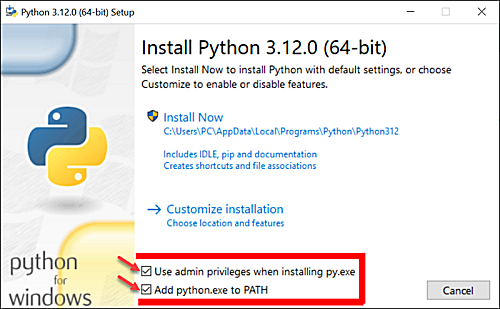
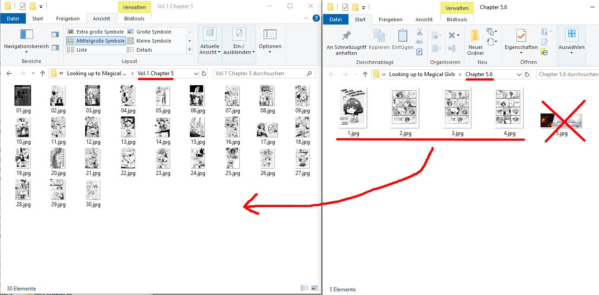

> [!WARNING]
> This project is still under developement, so please don't use it atm

### Homepage: [https://github.com/comic-manga-ebook/](https://github.com/comic-manga-ebook/)

### Table of contents
- [About this repository](#about-this-repository)
- [Installation](#installation)
- [The source-files (in a perfect world)](#the-source-files-in-a-perfect-world)
- [The source-files (in real life)](#the-source-files-in-real-life)
- [Using the file-cleaner](#using-the-file-cleaner)
  - [Available functions](#available-functions)
  - [Cleaning source-files example](#cleaning-source-files-example)
- [Using the builder](#using-the-builder)
  - [Initialize the book](#initialize-the-book)
  - [Prepare for build](#prepare-for-build)
  - [Build the book(s)](#build-the-books)
- [Building an advanced book](#building-an-advanced-book)


## About this repository
This is a **simple-to-use builder** to build *.ecmb-files from your source-images without knowing anything about programming.<br/>
In real life, when you have downloaded a comic or manga the files are really messy - the **file-cleaner**  will make it easier for you cleaning the contents.

Published under [MIT License](https://choosealicense.com/licenses/mit/)

**Copyright:**

Copyright (c) 2023 Clemens K. (https://github.com/metacreature)

**If you like it I would be happy if you  [donate on checkya](https://checkya.com/1hhp2cpit9eha/payme)**<br /><br />


## Installation
- download and install Python3 (>=3.11) [https://www.python.org/downloads/](https://www.python.org/downloads/)<br/>
  Here is a little guide how to install python on Windows [https://www.digitalocean.com/community/tutorials/install-python-windows-10](https://www.digitalocean.com/community/tutorials/install-python-windows-10)<br/>
  Don't forget to check these 2 checkboxes!<br/>
  
- download and install Git [https://git-scm.com/downloads](https://git-scm.com/downloads)<br/>
  Here is a little guide how to install and open git console: [https://www.youtube.com/watch?v=lKYtK-DS0MY](https://www.youtube.com/watch?v=lKYtK-DS0MY)
- create an empty folder on your harddisk (eg. "comic_manga") and open it
- download or clone the repository and save the contents to a subfolder "ecmb_builder"
- open the git-console with right-click (like you learned in the video) and then type or copy the commands to the console and press `[ENTER]` after each command:
    - `mkdir source_dir`
    - `mkdir output_dir`
    - `cd ecmb_builder`
    - `pip install -r requirements.txt`<br /><br />
     <br /><br />
      
- after that there are 3 subfolders in your "comic_manga"-folder: <br/><br/>

- open the folder "ecmb_builder" and open the config-file `ecmb_builder_config.yml` with any simple text-editor<br/>
  (I would recommend to use [https://notepad-plus-plus.org/downloads/](https://notepad-plus-plus.org/downloads/)) and do your settings there (or just leave it as it is).

<br />

## The source-files (in a perfect world)
Your source-files have to be located in "comic_manga/source_dir" (if you didn't specify a different one in the config-file)

File-Structure:
```
source_dir/
    ˪ My_Book_Folder
        ˪ chapter_0001
             ˪ img_0000010.jpg
             ˪ img_0000020.jpg
             ˪ img_0000030.jpg
             ˪ img_0000040.jpg
        ˪ chapter_0002
        ˪ chapter_0003
        ˪ chapter_0004
        ˪ cover_front.jpg
        ˪ cover_rear.jpg
```
or 
```
source_dir/
    ˪ My_Book_Folder
        ˪ volume_001
            ˪ chapter_0001
               ˪ img_0000010.jpg
               ˪ img_0000020.jpg
               ˪ img_0000030.jpg
               ˪ img_0000040.jpg
            ˪ chapter_0002
            ˪ chapter_0003
            ˪ chapter_0004
            ˪ cover_front.jpg
            ˪ cover_rear.jpg
        ˪ volume_002
        ˪ volume_003
        ˪ volume_004
```
<br/>

- the file- and folder-names are sorted alphanumeric (like every file-system)
- files and folders starting with "__" (2 underscores) are ignored in general
- allowed image-extension: jpg, jpeg, png, webp
- if you have cover-images they have to have one of these names:

| Front-Cover:     | Rear-Cover:     |
| ---------------- | --------------- |
| cover_front.jpeg | cover_rear.jpeg |
| cover_front.jpg  | cover_rear.jpg  |
| cover_front.png  | cover_rear.png  |
| cover_front.webp | cover_rear.webp |
| front.jpeg       | rear.jpeg       |
| front.jpg        | rear.jpg        |
| front.png        | rear.png        |
| front.webp       | rear.webp       |
| f.jpeg           | r.jpeg          |
| f.jpg            | r.jpg           |
| f.png            | r.png           |
| f.webp           | r.webp          |
<br/>

**Note!** If you have many books in your source-folder you can organize them in subfolders<br /><br />

## The source-files (in real life)



<br />

## Using the file-cleaner
Of course you want to clean that mess and the file-cleaner will make it easier for you. Files and folders starting with "__" (2 underscores) are ignored in general.

### Available functions
**Objects:**
- `volumes`
- `chapters`
- `images`
- `all`<br/><br/>

**Functions:**

Functions will sort the names alphanumerical and will preserve their order.
- `zeropad`<br/>
  will prefix everything with 0000
- `prefix`<br/>
  will prefix everything with an incremental zero-filled number eg. 0010, 0020, 0030
- `reverse`<br/>
  will prefix everything with an incremental zero-filled number in reverse order
- `rename`<br/>
  will rename everything with an incremental zero-filled number. You will loose the original name<br/><br/>

**Run it in git-console:**
- open the folder "ecmb_builder"
- open the git-console with right-click (like you have done before)
- type `invoke [FUNCTION] [OBJECT] "[MY_BOOK_FOLDER]"` eg. `invoke rename images "My_Book_Folder"` and press `[ENTER]`<br/><br/>


**Special Functions:**

Special functions will try to help you, but you have to check the results manually.
- `parse chapters`<br/>
  The renamer searches for a 'c' followed by one or two numbers and brings them to a new order with an incremental zerofilled prefix. It will shuffle up your chapter-folders, but you won't loose original name!
- `group volumes [NUMBER]`<br/>
  will group your chapter to [NUMBER] volumes, based on the average page-count

<br />

### Cleaning source-files example

- If we take the messy example from above i would suggest to `parse chapters` first:<br /><br/>
 <br /><br />
Now your folders will look like this. Of course you have to check it and solve issues manually:<br /><br/>
<br /><br />
- After solving the issues you can run `rename images`:<br /><br/>
<br /><br />
Now your images have unique incremental names and you can merge chapters and clean images easily:<br /><br/>
<br /><br />
- After you have merged the chapters manually your folder should look like this:<br /><br/>
<br /><br />
- I guess you don't like the names, so you should rename your chapters now:<br /><br/>
<br /><br />
but I guess you are too lazy to rename them manually. So run `rename chapters`:<br /><br/>
<br /><br />
After that it should look like this, of course after you added "Extra" manually:<br /><br/>
<br /><br />
- After you have deleted all advertisements and credits from your source-images you can run `group volumes`:<br /><br/>
<br /><br />
Done! (of course you have to check the result)<br /><br/>
<br /><br />
- As a final step it would be a good idea to add at least the front-covers now!<br/><br/>

## Using the builder

### Initialize the book

**There are 3 types to initialize:**
- `basic`
- `translated`
- `full`

When you initialize a book a file named `book_config.json` will be generated in the source-folder of your book. The diffrence between those types is simply the number of values can set.<br />
You could add values or write this file enterly manually if you want, but its a great help if you generate it with `init`. If you delete the file you have to run init again (or create it manually).<br />
Init will parse the folder-names of your chapters. If there is a name after the prefix it will suggest it as  a label. If not, it will automatically name it `Chapter [NUMBER]` (if there is a chapter like "Extra" in between the number won't be increased of course). Even other prefixes are than `chapter_[NUMBER]_` are supported. The Regex for the prefix is: `^(chapter_|item_)?[0-9%_. +~-]+` (I guess you understand this, even if you are not a programmer)

**Note!** If your downloader allready created that file you can skip this step<br /><br/>

**Run it in git-console:**
- open the folder "ecmb_builder"
- open the git-console with right-click (like you have done before)
- type `invoke init [TYPE] "[MY_BOOK_FOLDER]"` and press `[ENTER]`<br /><br/>
  <br /><br />
  Now the file `book_config.json` is in your book-folder<br /><br/>
  <br /><br />

### Prepare for build

- You should open the file `book_config.json` with a simple text-editor and add the meta-data like summary, genres.<br />
Optional information you can leave empty, default or simply delete them if you don't need it. If you leave them to default they won't appear in the book.
- what the hell is `"start_with": "my_image_name.jpg#left"` at the chapters?<br />
If there is a prolog, spacer-images you don't want to delete or the chapter starts with a double-page-image its good to specify where the reader-app should jump, if you click on a chapter. When I was building ePub-files it was really confusing that the chapter started with a "random" image instead of the chapter's title-image. For double-page-images you could use `#left`, `#right` or `#auto`<br/><br/>


### Build the book(s)

- open the folder "ecmb_builder"
- open the git-console with right-click (like you have done before)
- type `invoke build "My_Book_Folder"` and press `[ENTER]` to build all volumes<br />
  type `invoke build "My_Book_Folder" --volumes "1,2,5"` and press `[ENTER]` if you only want to build specific volumes<br /><br/>
  <br /><br />
- Done - your files are in the output-dir! __* yippee *__<br /><br/>
  

<br/>

## Building an advanced book

## The source-files 
Your source-files have to be located in "comic_manga/source_dir" (if you didn't specify a different one in the config-file), the book contents have to be in a subfolder "contents" and the cover-images have to be placed in the root.
The naming of the files and folders is up to you! You can mix chapters and images like you want and can have as many levels of subfolders like you want. 

- the file- and folder-names are sorted alphanumeric
- files and folders starting with "__" (2 underscores) are ignored in general
- allowed image-extension: jpg, jpeg, png, webp

File-Structure:
```
source_dir/
    ˪ My_Book_Folder
        ˪ contents
            ˪ item_000010
                 ˪ item_000010.jpg
                 ˪ item_000020.jpg
                 ˪ item_000030
                       ˪ item_000010.jpg
                       ˪ item_000020.jpg
                       ˪ item_000030.jpg
                       ˪ item_000040.jpg
                 ˪ item_000040.jpg
                 ˪ item_000050.jpg
            ˪ item_000020
            ˪ item_000030
            ˪ item_000040_Bonus
        ˪ cover_front.jpg
        ˪ cover_rear.jpg
```

### Initialize the book

**run:**
- `invoke init pro "[MY_BOOK_FOLDER]"`

When you initialize a book a file named `book_config.json` will be generated in the source-folder of your book. <br />
Its a great help, but if you want you can write it enterly on your own or generate it with an external program.<br />
Init will parse the folder-names of your chapters. If there is a name after the prefix it will suggest it as  a label. If not, it will automatically name it `Chapter [NUMBER]` (if there is a chapter like "Bonus" in between the number won't be increased of course). The Regex for the prefix is: `^(chapter_|item_)?[0-9%_. +~-]+` (I guess you understand this, even if you are not a programmer).

### The difference to a simple book
For a simple book the the reference to the source-folders is at the same time the navigation. For a professional book there is no reference to the contents - it simply imports everything whats in the folder "contents". <br/>
Instead you can specify an advanced navigation, which supports chapters, headlines and links. You can do anything you want there as long the referred images and folders exist.


### Prepare for build

You should open the file `book_config.json` with a simple text-editor and add the meta-data like summary, genres.<br />
Optional information you can leave empty, default or simply delete them if you don't need it. If you leave them to default they won't appear in the book.

**The Navigation:**
```
{
    "type": "chapter",
    "dir": "[MANDATORY PATH TO A FOLDER RELATIVE TO THE PARENT CHAPTER's PATH]",
    "label": "[MANDATORY LABEL]",
    "title": "[OPTIONAL TITLE]",
    "start_with": "[OPTIONAL PATH TO AN IMAGE RELATIVE TO THIS CHAPTER's PATH]",
    "children": []
}
```
```
{
  "type": "headline",
  "label": "[MANDATORY LABEL]",
  "title": "[OPTIONAL TITLE]",
  "children": [
    ... at minimum 1 Child!!!!!!
  ]
}
```
```
{
  "type": "link",
  "label": "[MANDATORY LABEL]",
  "title": "[OPTIONAL TITLE]",
  "target": "[MANDATORY PATH TO AN IMAGE RELATIVE TO THE PARENT CHAPTER's PATH]",
}
```

**Note!** if you want to link a double-page-image you could use `#left`, `#right` or `#auto`


### Build the book(s)

- open the folder "ecmb_builder"
- open the git-console with right-click (like you have done before)
- type `invoke build "My_Book_Folder"` and press `[ENTER]` to build the book<br />
  <br /><br />
- Done - your files are in the output-dir! __* yippee *__<br /><br/>
  

<br/>
